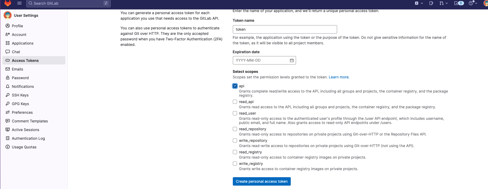

# ReadMe

**install**

*引入*

in composer.json
```json
"repositories" : [
        { 
            "url" :"https://gitlab.mgmt.168tech.vip/api/v4/group/23/-/packages/composer/packages.json",
            "type" :"composer"
        }
    ],

```
*建立Token*



將 token 寫入 composer config
```
$ composer config -g gitlab-token.<DOMAIN-NAME> <personal_access_token> (global)
```

*套件安裝*
```
$ composer require 168tech/cicd-status-publisher
```
---
**自定義發送訊息Hook**

in `.env` file add
```
UPGRADE_HOOK_URL="https://your.hook.url"
```

**呼叫指令**
```
$ php artisan upgrade develop
$ php artisan upgrade staging
$ php artisan upgrade cron
$ php artisan upgrade master
```

**客製化設定檔**
```
$ php artisan vendor:publish --provider="XinYin\UpgradeTool\MessageHookServiceProvider" --tag="config"
```

## 設定檔說明

**env**
- 環境設定
- key 代表呼叫時需要的帶的參數
- symbol 代表該環境的tag所會統一使用的符號
- name 為環境名稱

**url**
- 設定 hook 要傳遞的url